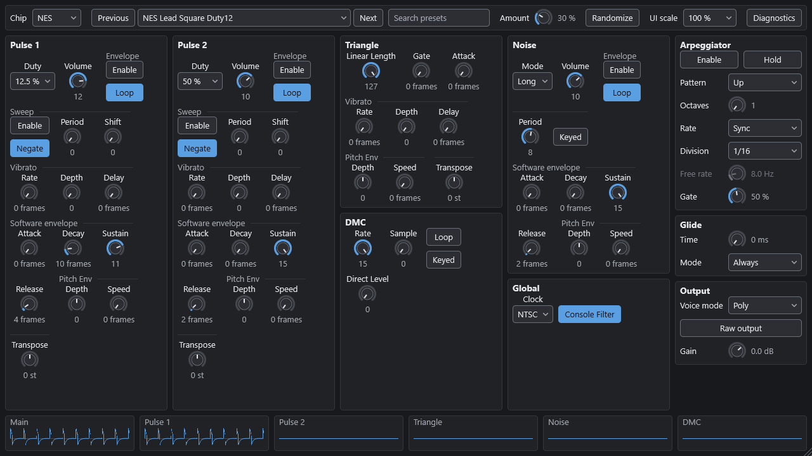
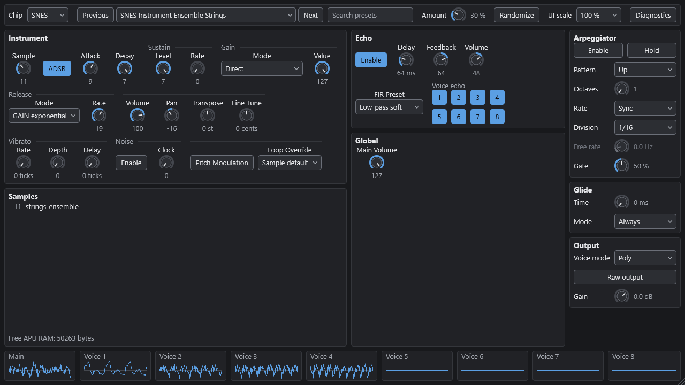
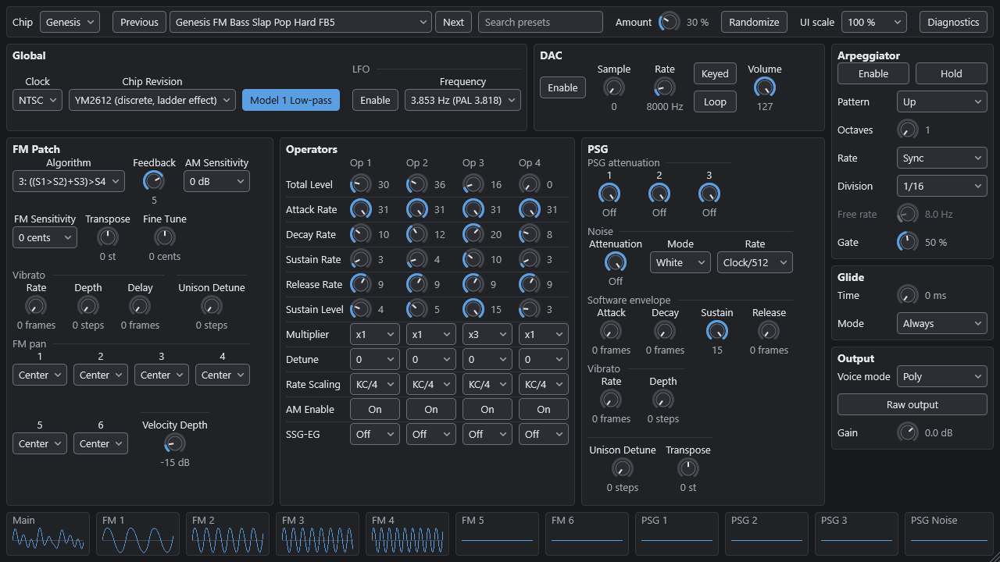
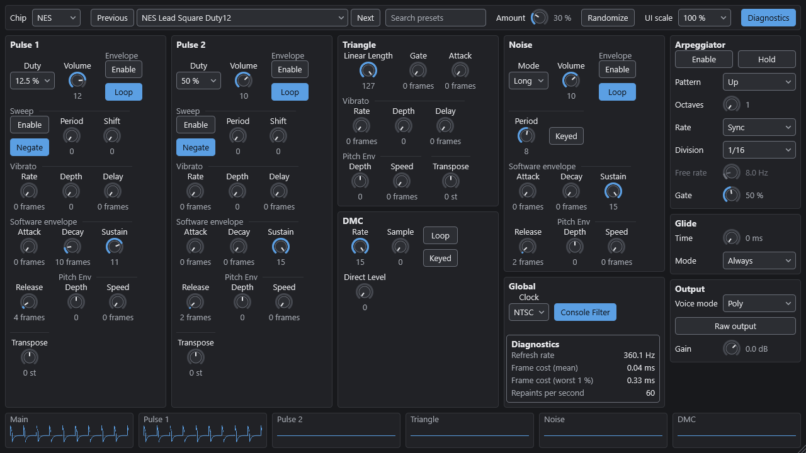
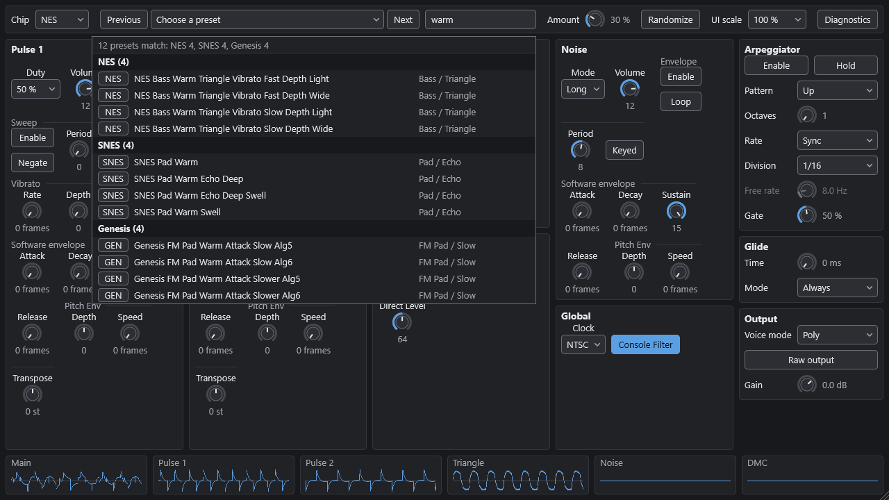

# retro-chip-vst

Retro Chip is a VST3 instrument for Windows x64 that emulates three game-console sound
chips: the NES 2A03/2A07 APU, the SNES S-DSP, and the Sega Genesis YM2612 FM chip with
its SN76489 PSG. Each engine clocks a register-level model of the chip at its native rate
and resamples the output with band-limited steps. A small "driver" layer, like the sound
code a game runs on the console CPU, turns MIDI into register writes. The hardware's
limits are kept on purpose: period and F-number quantisation, 4-bit volumes, the NES
non-linear mixer, BRR and Gaussian interpolation on the SNES, the YM2612 9-bit DAC and
ladder effect. The plugin ships 1042 generated presets and 78 samples: the SNES
instruments and drum kit and the Genesis DAC drums are converted from CC0 recordings
(VSCO 2 Community Edition and the Versilian Community Sample Library), the way 1990s
composers used sample CDs; the NES DMC set, the chip waveforms, noises, pads, guitars,
choirs and synth basses are procedural. All behaviour was implemented from public
documentation only (`docs/SOURCES.md`). No emulator source code was read or used.

## Screenshots

The editor at 100 % scale (1280 x 720), one panel per chip. The strip at the bottom shows
one scope per hardware channel plus the main output.

NES: two pulses, triangle, noise and DMC, with the arpeggiator, glide and output sidebar.



SNES: instrument (sample, ADSR/GAIN, vibrato, noise, pitch modulation), echo with FIR
presets and per-voice echo, and the loaded samples with the free APU RAM.



Genesis: FM patch, the four-operator grid, DAC, PSG and the global chip settings (clock,
chip revision, Model 1 low-pass, LFO).



Diagnostics overlay (detected refresh rate, frame cost, repaints per second).



Preset search over the three chips ("warm"): results grouped by chip with a chip tag,
the name and the category / subcategory; the header line counts the results per chip.



Screenshots are taken by the standalone build's capture hook (`RCV_SCREENSHOT`, see
`plugin/src/PluginEditor.h`) with a held chord so the scopes show real waveforms.

## Prerequisites

* Windows 10 or 11, x64.
* Visual Studio 2022 or the Visual Studio 2022 Build Tools, with the "Desktop development
  with C++" workload and the "C++ CMake tools for Windows" component (CMake 3.22 or newer
  and Ninja come with it).
* Python 3.12 or newer, needed only to regenerate samples and presets (standard library
  only).

There are no other dependencies. CMake downloads JUCE 9.0.3 and Catch2 v3.16.0 as
release archives pinned by SHA-256 (`cmake/Dependencies.cmake`). If a checkout exists at
`third_party/JUCE` (git-ignored), CMake uses it instead of downloading JUCE again.

## Build

One command, from a PowerShell prompt at the repository root:

```powershell
.\build.ps1                 # configure, build, run all tests (preset windows-x64-release)
.\build.ps1 -Install        # same, then copy the .vst3 to C:\Program Files\Common Files\VST3
.\build.ps1 -Preset dsp-only-release   # chipdsp and its tests only, no JUCE
.\build.ps1 -NoTests        # skip ctest
.\build.ps1 -Clean          # delete build\<preset> first
```

`build.ps1` finds Visual Studio with `vswhere`, loads the x64 developer environment and
uses the CMake and Ninja that ship with Visual Studio when they are not on `PATH`.

The same steps with raw CMake commands:

```powershell
. .\tools\dev-env.ps1                          # MSVC x64 environment, cmake, ninja
cmake --preset windows-x64-release
cmake --build --preset windows-x64-release
ctest --preset windows-x64-release
```

Presets (`CMakePresets.json`): `windows-x64-release`, `windows-x64-debug`,
`dsp-only-release` (no JUCE), `plugin-dev` (plugin with placeholder engines, for UI
work), and `vs2022` (a Visual Studio solution).

### Output and installation

The bundle is written to:

```
build\windows-x64-release\plugin\RetroChip_artefacts\Release\VST3\Retro Chip.vst3
```

To install it, run `.\build.ps1 -Install`, which copies it to
`C:\Program Files\Common Files\VST3` (the standard VST3 folder; Windows asks once for
administrator rights), or copy the `Retro Chip.vst3` folder there by hand.

Then rescan plugins in the host.

## Project structure

```
dsp/include/chipdsp/   public headers: IChipEngine.h, ChipTypes.h, util/, nes/, snes/, genesis/, perf/
dsp/src/<area>/        chipdsp static libraries (util, nes, snes, genesis, perf, factory); no JUCE
dsp/tests/             Catch2 tests, test_<area>_*.cpp -> chipdsp_tests_<area>
dsp/bench/             chipdsp_bench (CPU cost per engine)
dsp/tools/             chiptool (parameter dump, WAV render, preset features)
plugin/src/            JUCE layer: processor, EngineHost, parameters, presets, MIDI learn, editor (ui/)
plugin/tests/          plugin_tests (processor, presets, state, real engines)
tools/                 gen_samples.py, gen_presets.py, presetgen/, samplegen/, dev-env.ps1, run_pluginval.ps1
assets/                generated preset banks (presets/*.json) and samples (samples/, index.json)
docs/                  ARCHITECTURE, ENGINE_SPECS, PLUGIN_SPECS, PRESET_SPECS, PRESET_QA,
                       HARDWARE_NOTES (ambiguities and decisions), SOURCES, research/
```

The presets and samples are embedded in the plugin binary at build time.

## Engines

Each engine has two layers. The chip core models registers, counters, clocking and
mixing as documented. The driver writes registers at a game driver's rate: every video
frame on the NES (60.0988 / 50.0070 Hz) and the Genesis (59.92274 / 49.70146 Hz), every
4 ms on the SNES. Software features (vibrato, software envelopes, pitch envelopes,
gating, unison) run in the driver, go through the registers, and are labelled as
software in the parameter lists. `docs/ENGINE_SPECS.md` lists every parameter;
`docs/HARDWARE_NOTES.md` records each decision taken where the documentation is
ambiguous.

The only processing that is not chip behaviour is the output stage: a 5 Hz DC blocker
standing for the coupling capacitor (not a documented value), the optional console
filters, and resampling. `Raw output` replaces the band-limited resampler with a
zero-order hold, so the hardware's aliasing is heard as it would be through a wide-band
capture chain.

### NES (2A03 NTSC, 2A07 PAL)

* Channels: Pulse 1, Pulse 2, Triangle, Noise, DMC, clocked at the CPU clock (1789773 /
  1662607 Hz).
* Emulated: the four duty sequences, the hardware envelope, length counters, sweep with
  its mute rules, the triangle's linear counter, the noise LFSR (long mode 32767 steps,
  short mode 93 or 31), the DMC 1-bit delta counter, the frame sequencer (4- and 5-step
  modes), the exact non-linear mixer, and the NES-001 filters (90 Hz and 440 Hz
  high-pass, 14 kHz low-pass) under `console_filter`.
* Quirks kept: 11-bit period quantisation (low notes are out of tune); the sweep mutes a
  channel whose period is below 8 or whose target exceeds $7FF; a $4003/$4007 write
  restarts the duty phase; the triangle has no volume control; the DMC level changes the
  loudness of triangle and noise through the mixer; periods 0 and 1 of the triangle give
  a constant 7.5; PAL has its own period, noise and DMC tables.
* Samples: 16 DMC slots of up to 4081 bytes, encoded to 1-bit delta at the `dmc_rate` in
  use.

### SNES (S-DSP)

* Channels: 8 voices at 32000 Hz.
* Emulated: BRR decoding (four filters, the shift 13-15 rule), 4-point Gaussian
  interpolation from the 512-entry table, 14-bit pitch with pitch modulation (PMON),
  noise, ADSR and the five GAIN modes with the global rate counter and offset tables,
  key-on and key-off timing, the 8-tap FIR echo with feedback, the 16-bit clamps, and the
  final phase inversion.
* Quirks kept: the Gaussian filter's muffled top end; the key-on delay (5 silent samples
  before the first data sample); the echo buffer takes APU RAM (EDL x 2 KiB) from the
  64 KiB shared with the samples; FIR sums wrap and clamp as documented.
* Samples: 32 slots encoded to BRR, sharing the 64 KiB APU RAM with the echo buffer. A
  load that does not fit is refused and reported. The Samples box on the SNES panel
  shows the loaded slots and the free APU RAM.

### Genesis (YM2612 and SN76489)

* YM2612: 6 FM channels with 4 operators, 8 algorithms, feedback, detune, multiplier,
  key scaling, the envelope generator (12-bit global counter, one update per 3 FM
  samples, attack formula, SL 15 = 93 dB), SSG-EG, LFO with AM and PM, and the DAC on
  channel 6. Output is at 53267 Hz (NTSC).
* `chip_revision` 0 (default) is the discrete YM2612 with the ladder effect, a DAC
  crossover gap around zero that adds distortion at low levels. 1 is the YM3438 / ASIC
  without it.
* SN76489 (the PSG in the VDP): 3 tone channels and 1 noise channel, 16-bit LFSR with
  taps 0x0009 (white noise period 57337, periodic 16), 2 dB attenuation steps, and
  periods 0 and 1 giving a constant +1.
* Quirks kept: 9-bit DAC truncation; F-number and block quantisation; AM still applies
  while the LFO is disabled; the PSG is 16.1 dB below one FM channel at full scale (the
  factory presets' `preset_gain` brings PSG presets to the common playing level, up to
  +36 dB). The optional Model 1 low-pass
  (`model1_lowpass`, first order at 3.39 kHz) is available; Model 2 filtering is not
  modelled.
* Samples: 16 DAC slots of 8-bit PCM, up to 64 KiB each, played at `dac_rate`.

The chip output is relative to the hardware and is not normalised: one NES pulse at
volume 12 is about -33 dBFS RMS, one Genesis FM channel about -26 dBFS RMS, one PSG tone
about -45 dBFS. Each factory preset sets `preset_gain` (-24..+36 dB, no panel control),
which the plugin applies after the chip together with `master_gain`, so a held note plays
at about -18 dBFS RMS (C4, velocity 100) with its peak at or below -1 dBFS at every
velocity up to 127. The ratios between channels and the NES
mixer curve are unchanged. Presets that do not set it (user presets saved before it
existed) play at the chip level. `master_gain` (-24..+12 dB) stays the user's control.

## Multi-output buses

The plugin has a stereo `Main` bus plus ten stereo buses `Out 1` .. `Out 10`, disabled by
default. The layout never changes when the chip changes. Each enabled bus carries one
hardware channel alone, through the chip's real output stage.

| Bus | NES | SNES | Genesis |
|---|---|---|---|
| Out 1 | Pulse 1 | Voice 1 | FM 1 |
| Out 2 | Pulse 2 | Voice 2 | FM 2 |
| Out 3 | Triangle | Voice 3 | FM 3 |
| Out 4 | Noise | Voice 4 | FM 4 |
| Out 5 | DMC | Voice 5 | FM 5 |
| Out 6 | (silent) | Voice 6 | FM 6 / DAC |
| Out 7 | (silent) | Voice 7 | PSG tone 1 |
| Out 8 | (silent) | Voice 8 | PSG tone 2 |
| Out 9 | (silent) | (silent) | PSG tone 3 |
| Out 10 | (silent) | (silent) | PSG noise |

The per-channel SNES buses are dry: they carry the voice through VOL L/R and MVOL, with
no echo. `Main` always carries the full mix; the per-channel buses are copies, not a
split of it.

Routing the outputs in Renoise:

1. Load Retro Chip as an instrument and open the instrument's plugin properties.
2. Enable the plugin's extra outputs there, and route `Out 1` .. `Out 10` to tracks.
3. Play notes on each hardware channel and check that each track receives its
   channel, that `Main` still carries the full mix, and that switching the chip does not
   change the routing.

## MIDI

* `Voice mode` = `Poly` (default): notes on any MIDI channel are shared among the
  hardware channels enabled in `poly_channels`, with oldest-note stealing. The default
  (`poly_channels` = 0) is the chip's own mask: NES pulses and triangle, all 8 SNES
  voices, Genesis FM 1..6. `poly_channels` is a 10-bit mask (bit n = hardware channel n,
  numbered like the buses from 0). The `Poly channels` toggles in the Output box show it
  for the active chip (NES P1 P2 Tri / Noi DMC, SNES 1..8, Genesis F1..F6 / T1 T2 T3 N;
  lit = used) and a click switches one channel; the last lit channel stays on, and a mask
  equal to the chip's default is stored as 0 so it keeps following the chip. The host's
  parameter list, automation and presets can set it too. A mask with no channel of the
  current chip falls back to the chip's default. The toggles are disabled in `MIDI
  channel` mode, which does not use the mask.
* `Voice mode` = `MIDI channel`: MIDI channel N plays hardware channel N-1. NES: 1..5
  (4 = noise, 5 = DMC); SNES: 1..8; Genesis: 1..6 FM (6 is the DAC when `dac_enable` is
  on), 7..9 PSG tone, 10 PSG noise.
* Pitch bend: +/-2 semitones, applied at the next driver tick with the chip's
  quantisation. CC 64 (sustain) holds the note-offs of played notes. CC 120, 121 and 123
  act on their own MIDI channel. Other CCs go to MIDI learn.
* The arpeggiator (Up, Down, Up-Down, As played, Random; 1-4 octaves; host-synced or free
  rate; gate; hold) runs before voice allocation. Glide is linear in semitones (0-2000 ms,
  Always or Legato only) and goes through the register quantisation.

### MIDI learn

Right-click any knob, toggle or choice and pick "MIDI learn", then move a controller. The
first CC received on any channel is bound to that parameter; a CC already in use moves to
the new parameter. "Clear MIDI mapping" removes it. CC values map linearly onto the
parameter's range. Mappings are saved with the plugin state.

### Randomizer

`Randomize` redraws every parameter of the active chip shown on the panel, within
+/- `amount` x range around the current value (amount 0.3 by default); choice parameters
are redrawn with probability `amount`. Values never leave the hardware bounds. Sample
slots, `clock`, `chip_revision`, `console_filter`, `model1_lowpass`, `main_volume`,
`master_gain` and the global performance parameters are never touched.

### Presets and samples

The preset browser has a two-level menu (category, then subcategory) for the current
chip, a search field over all three chips, and previous/next buttons. Banks: NES 311,
SNES 338, Genesis 393 presets.

Search: type one or more words; a preset is listed when every word matches (any case) a
part of its name, category, subcategory or tags, or names its chip (`nes`, `snes`,
`genesis` or `gen`, which select that chip only). Examples: `bass` (every bass category,
name and tag on the three chips), `genesis bass`, `pad echo`, `nes lead vibrato`. Results
are grouped by chip (NES, SNES, Genesis, then category, subcategory and name); each row
shows a chip tag (NES / SNES / GEN), the name and "Category / Subcategory", and the list
header gives the count per chip, or "No preset matches". Click a result, or use Up/Down
and Return, to load it: a result of another chip switches the chip and its panel, and the
search stays. Previous/Next then walk through the results, across chips. Escape clears
the search.

Keyboard: while the search field has the focus it takes every key, so typing a search
does not also play the host's computer-keyboard notes (Renoise and others); Ctrl and Alt
shortcuts the field does not use still reach the host. Escape, Return on a result or a
click anywhere else in the editor hands the keyboard back to the host. Limit: this relies
on JUCE's Windows key handling (the plugin reports each key as handled); a host that reads
the keyboard by other means may still see the keys. It is covered by the plugin tests up
to JUCE's key handling; the behaviour inside Renoise can only be checked by hand.

The preset menu also has "Export current settings..." (JSON) and "Import sample into
slot N..." (a WAV into the slot the chip's sample parameter points to; root note 60,
one-shot). Imported samples are saved in the plugin state. Loading a preset clears the chip's other factory samples, so any sequence
of presets fits the SNES APU RAM. Failed loads are shown under the sidebar forms.

### Sample provenance

Of the 78 factory samples, 42 are converted from CC0 1.0 recordings and 36 are procedural
(generated by `tools/gen_samples.py`, no third-party material):

| Chip | CC0 (VSCO 2 CE) | CC0 (VCSL) | Procedural |
|---|---|---|---|
| NES | 0 | 0 | 16 (the whole DMC set) |
| SNES | 13 | 17 | 18 (chip waveforms, noises, pads, guitars, choirs, synth basses) |
| Genesis | 2 | 10 | 2 (noise burst, voice) |

* VSCO 2 Community Edition (https://github.com/sgossner/VSCO-2-CE) and the Versilian
  Community Sample Library (https://github.com/sgossner/VCSL), both by Versilian Studios,
  both CC0 1.0 (licence files and the GitHub API checked on 2026-09-29), pinned to one
  commit each in `tools/samplegen/cc0_manifest.json`. Credit, kept as the VSCO readme
  asks: Versilian Studios / Sam Gossner and Ivy Audio / Simon Dalzell.
* The manifest lists, for every converted sample, its source files, git blob ids, root
  note, rate, loop and processing; `assets/samples/index.json` carries `source` and
  `licence` for every sample (procedural ones say "original").
* Never used: samples ripped from games, ROMs or soundtracks, and FM patch collections
  ripped from games. Details and licence notes: `docs/SOURCES.md`, "Samples (CC0
  recordings)".

## Diagnostics mode

The `Diagnostics` button in the strip shows an overlay (off by default, no cost when off):

* Refresh rate: 1 / median interval between the display's vblank timestamps, over 2 s.
* Frame cost: the editor's mean work per displayed frame over 2 s (vblank callback plus
  every paint since the previous vblank). It is work time, not the frame interval.
* Worst 1 %: the 99th percentile of the frame cost over 2 s.
* Repaints: editor paints per second. It must read 0 at rest (the editor repaints only
  when something changed; the text caret does not blink).

The editor is driven by the display's vblank, so it repaints at the display's own refresh
rate while something changes, and reads 0 repaints per second at rest.

## Regenerating samples and presets

The generated files are committed. Run these steps only after changing the generators
or the seeds, then rebuild the plugin so it embeds the new files. Both generators are
deterministic: the same inputs produce byte-identical files.

```powershell
# 1. Samples -> assets\samples\<chip>\*.wav and assets\samples\index.json
#    (WAVs in tools\user_samples\<chip>\ are included, see its README). The CC0 source
#    recordings listed in tools\samplegen\cc0_manifest.json are read from third_party\cc0\
#    (git-ignored, about 55 MB); --fetch-cc0 downloads the missing ones at the pinned commits.
python tools\gen_samples.py --fetch-cc0

# 2. Build chiptool
. .\tools\dev-env.ps1
cmake --preset windows-x64-release
cmake --build --preset windows-x64-release --target chiptool

# 3. Candidate banks (parameter rules only) into a work folder
python tools\gen_presets.py --out build\presets-work --report build\presets-work\PRESET_QA.md --no-target-check

# 4. Render features through the real engines (two renders per preset)
foreach ($c in 'nes','snes','genesis') {
    build\windows-x64-release\dsp\tools\chiptool.exe features "build\presets-work\$c.json" "build\presets-work\$c.features.json" --samples assets\samples
}

# 5. Final banks -> assets\presets\*.json and the report docs\PRESET_QA.md
python tools\gen_presets.py --features build\presets-work\nes.features.json --features build\presets-work\snes.features.json --features build\presets-work\genesis.features.json

# 6. Rebuild the plugin
cmake --build --preset windows-x64-release
```

These steps were last run on 2026-09-30 for all three chips, after the NES kernel change
and with `preset_gain` (no parameter descriptor changed, so `dump-params` was not needed):
the kept presets and their parameters are unchanged (NES 314 expanded -> 311, SNES
338 -> 338, Genesis 393 -> 393), and step 5 wrote each preset's `preset_gain` from the
rendered level (`docs/PRESET_SPECS.md`, "Playing level"; distribution in
`docs/PRESET_QA.md`). Step 5 exits with a non-zero code when a bank is outside
its target size (`docs/PRESET_SPECS.md`).

The perceptual de-duplication in `docs/PRESET_QA.md` compares rendered features: a
stereo log-mel spectrum on active frames, a 10 ms envelope and an FFT pitch track, for a
held C4 and a short C3 after a pre-roll. Thresholds are at or below the usual
just-noticeable differences. Presets whose globals differ, or whose differences a single
note cannot reveal, are never merged. The last runs removed 3 NES presets and no Genesis
preset (Genesis bank regenerated on 2026-09-30 from the redesigned seeds, see
`docs/research/genesis-sound-design.md`).

The Python unit tests of the generator: `python -m unittest discover -s tools/tests`.

## Reference-emulator check

`tools/refcheck` compares the SNES and Genesis cores with reference emulators run as
black boxes (VGMPlay 0.40.9 with Nuked OPN2 and with the MAME / Genesis Plus GX cores; Game
Music Emu through FFmpeg 9.0.2). Their source code is never read. The stimuli are our own
register writes, BRR data and SPC700 program; the binaries go to `third_party\refemu\`
(git-ignored). Tools, hashes and settings: `docs/research/reference-emulators.md`.

```powershell
python tools\refcheck\make_stimuli.py
python tools\refcheck\compare.py --chiptool build\windows-x64-release\dsp\tools\chiptool.exe
# subset: --only NAME; reuse renders: --no-render; nulls at the fractional lag:
python tools\refcheck\fracnull.py [--ref ref_mame] fm_alg0 fm_alg7
```

A full run takes about 35 minutes (pure Python analysis) and writes
`docs/research/refcheck-report.md`, renders in `build-reports\refcheck\`. Last result
(2026-09-30): the S-DSP is bit-exact with Game Music Emu on static stimuli apart from the
player gain and polarity; SN76489 tones, levels and noise modes match; all eight YM2612
algorithms are within 0.11 dB of Nuked OPN2 after the fixes of findings F1 (S1 pipeline
delay) and F2 (resampler kernel). The NES (`--chips nes`, rerun on 2026-09-30 after the NES
switched to the integrated-step kernel) shows no engine deviation against NSFPlay.

## Listening set

`python tools\render_listening.py` renders an A/B set into `build-reports\listening\`
(git-ignored): 35 SNES and Genesis presets, 2-3 per category, each as a short phrase
(C major melody, bass line, slow pad notes, repeated drum hits or SFX notes; 3.6-4 s,
44.1 kHz, 16-bit stereo) named `<chip>_<category>_<preset>_{before,after}.wav`.
"before" takes the banks and samples of a git revision (`--before-ref`, default `HEAD`,
read with `git show`), "after" the working tree; both go through the same current
engine, so a pair isolates preset and sample changes. `INDEX.md` lists the pairs with
their peak and RMS levels and flags byte-identical pairs (unchanged presets kept as
controls). `chiptool render` applies the preset's `preset_gain`, so "after" files play at
the factory levels; revisions before 2026-09-30 have none. It uses `chiptool render --notes 60,62,64 --step 0.4 --gate 0.8`, which plays
a monophonic phrase on the preset's hardware channel.

## Testing

* `ctest --preset windows-x64-release` runs every Catch2 suite: `chipdsp_tests_<area>`
  (tables, formulas and behaviour of each chip against documented values, band-limited
  steps, allocator, arpeggiator, glide) and `plugin_tests` (processor, presets, state
  round trip, MIDI learn, value text, and the `[real]` tests that sweep all presets
  through the real engines). Last run (2026-09-30): 330 of 330 passed.
* One area only: `cmake --build --preset windows-x64-release --target chipdsp_tests_nes`,
  then `build\windows-x64-release\dsp\tests\chipdsp_tests_nes.exe`. The plugin tests are
  in `build\windows-x64-release\plugin\tests\plugin_tests.exe`.
* pluginval: `.\tools\run_pluginval.ps1` (strictness 5) or
  `.\tools\run_pluginval.ps1 -Strictness 10`. The script downloads pluginval v1.0.4 from
  Tracktion's GitHub releases into `tools\bin` if it is missing, and returns
  pluginval's exit code. Strictness 5 passed on 2026-09-30 (strictness 10 last passed on
  2026-09-29); the VST3 validator step is skipped because no validator path is set.

## Continuous integration

`.github/workflows/build.yml` runs on GitHub Actions (Windows runner) for every push to
`main`, every pull request and on demand:

1. `.\build.ps1 -Preset windows-x64-release` (configure, build, ctest);
2. `.\tools\run_pluginval.ps1 -Strictness 5`;
3. the `.vst3` bundle, zipped as `RetroChip-VST3-win64.zip`, is kept as a run artefact
   (Actions tab, run page, "Artifacts"), with the pluginval reports.

Pushing a tag that starts with `v` (for example `git tag v0.2.0` then
`git push origin v0.2.0`) also attaches the zip to the GitHub Release of that tag,
creating the release when none exists. A release drafted beforehand (for example with
`gh release create v0.2.0 --draft`) keeps its notes and stays a draft until published. Unzip it and copy the `Retro Chip.vst3` folder into
`C:\Program Files\Common Files\VST3`. The plugin version comes from `project(VERSION)` in
`CMakeLists.txt`, not from the tag, so keep the two in step. Publishing a binary is
subject to the JUCE licence (see "Licence").

## Performance

Measured with `build\windows-x64-release\dsp\bench\chipdsp_bench.exe --seconds 5` on an
AMD Ryzen 7 9800X3D (8 cores), 32 GB RAM, Windows 11 (10.0.26200), release build. The
program renders 512-sample blocks with a note held on every hardware channel, and echo
and LFO enabled where the chip has them. The time includes the band-limited step
resampling and the SNES echo. "main + channels" also renders the ten per-channel outputs.

| Engine  | Rate  | Outputs         | Mean / block | Worst / block | % of real time |
|---------|-------|-----------------|--------------|---------------|----------------|
| NES     | 44100 | main only       |     146.4 us |      172.9 us |         1.26 % |
| NES     | 44100 | main + channels |     163.3 us |      178.6 us |         1.41 % |
| NES     | 48000 | main only       |     134.3 us |      148.6 us |         1.26 % |
| NES     | 48000 | main + channels |     149.8 us |      168.0 us |         1.40 % |
| SNES    | 44100 | main only       |      52.4 us |       60.7 us |         0.45 % |
| SNES    | 44100 | main + channels |      98.2 us |      127.6 us |         0.85 % |
| SNES    | 48000 | main only       |      48.4 us |       55.5 us |         0.45 % |
| SNES    | 48000 | main + channels |      94.1 us |      100.2 us |         0.88 % |
| Genesis | 44100 | main only       |     160.4 us |      226.1 us |         1.38 % |
| Genesis | 44100 | main + channels |     311.1 us |      503.3 us |         2.68 % |
| Genesis | 48000 | main only       |     146.8 us |      255.7 us |         1.38 % |
| Genesis | 48000 | main + channels |     286.9 us |      341.6 us |         2.69 % |

These figures cover one engine only. The plugin layer (MIDI, arpeggiator, parameter
forwarding, visualiser buffers) and the editor come on top. During a chip switch two
engines run together for 20 ms.

## Licence

Retro Chip is free software, licensed under the GNU Affero General Public License,
version 3 (`LICENSE`). Copyright (C) 2026 glitch191. It is a personal, non-commercial
project.

The plugin links JUCE 9, which it uses under JUCE's AGPLv3 option. Anyone who
redistributes the plugin, modified or not, must provide its source code under the same
licence. Catch2 (Boost Software Licence) is used only by the tests. pluginval is a
separate tool downloaded for validation and is not linked. The SNES and Genesis samples
converted from CC0 recordings keep their CC0 status; their sources are listed in
`docs/SOURCES.md`.

## Known limitations and what was not verified

* No listening validation against real consoles was done. Fidelity rests on the
  documented tables and formulas, the tests and the reference-emulator check; the presets
  were checked by rendered features and objective measurements. The A/B listening set
  (`tools/render_listening.py`) is ready but nobody has listened to it yet.
* The pluginval VST3 validator step was skipped (no validator path set).
* Only Windows x64 and VST3 are built. The Standalone target
  (`-DRCV_BUILD_STANDALONE=ON`) exists for development and screenshots only.
* Not modelled: the Genesis Model 2 output filter (no published cutoff), the Model 1
  VA3-VA6 2.84 kHz variant, the YM2612 timers and CSM mode, GManiac's DAC level-ordering
  glitches, the Famicom output stage, and the NES $4011 write collision.
* The YM2612 LFO divider table could not be re-read from its only source during
  verification (`docs/HARDWARE_NOTES.md`, "LFO frequencies").
* The scope of the MIDI Channel Mode messages (CC 120/121/123 per channel) follows
  general knowledge of the MIDI 1.0 specification; the document was not re-read.
* Levels are hardware-relative at the chip output; the factory presets' `preset_gain`
  evens them out. 17 Genesis PSG presets (soft level variants) stop at the +36 dB bound,
  3-11 dB below the -18 dBFS target; presets whose velocity-127 peak reaches the -1 dBFS
  ceiling (260 of 1042) play their velocity-100 note below the target; and level variants
  ("Level Soft", ghost notes) now play near the common level. The ceiling is checked for a
  single note: chords and the arpeggiator's overlapping notes can exceed it.
* The DC blocker (5 Hz) and the output coupling behaviour at reset are modelling
  choices, not measured hardware values.
